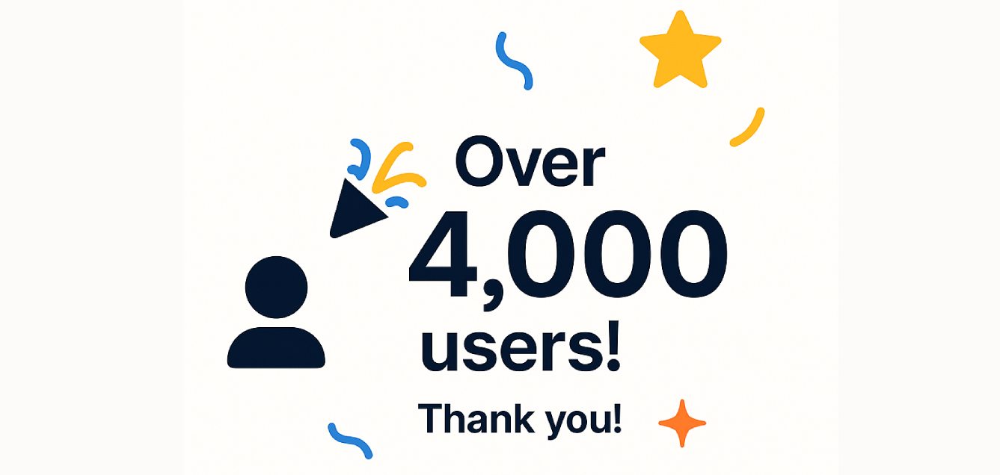

  

# Netflix Password-Sharing (household) Bypass Extension

An extension that allows bypassing Netflix's password-sharing restrictions.
If you like this project, consider giving it a star ⭐

## 📥 Installation on Chrome, Edge, Brave , or any other Chromium-based browser

## 📥 Installation on Firefox Browser

----

## ✨ Features

- Bypasses Netflix account-sharing restrictions
- Works directly in the browser with no complex configuration
-  Get Around the Netflix Password-Sharing Ban (Netflix household).

# 📝 Changelog
## [1.8.2] - 2025-06-11

### Fixes
 - 🔘 Removal of the unnecessary permission.

## 👥 Contributors
  

##  🤝 Contributing
Contributions are welcome! Feel free to submit a Pull Request or report an issue.

## ⚠️ Disclaimer

This extension may violate Netflix's terms of service. Use at your own risk.

---

## 📄 License
This project is licensed under the MIT License - see the LICENSE file for details.

---
### ⭐ If you find this extension helpful, please consider giving it a star! ⭐
